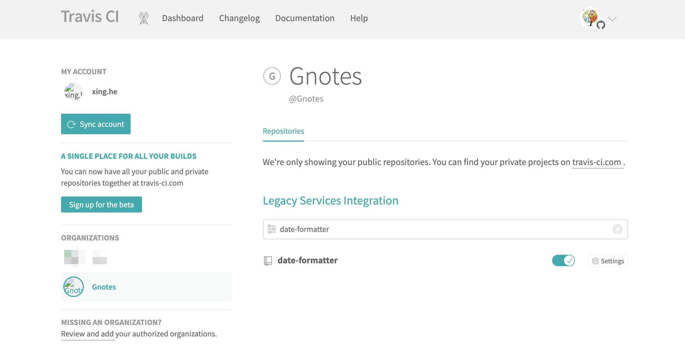
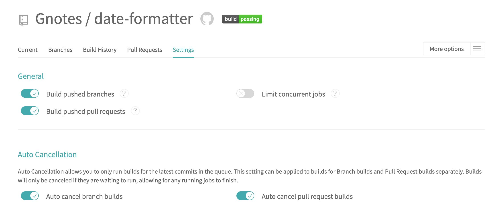
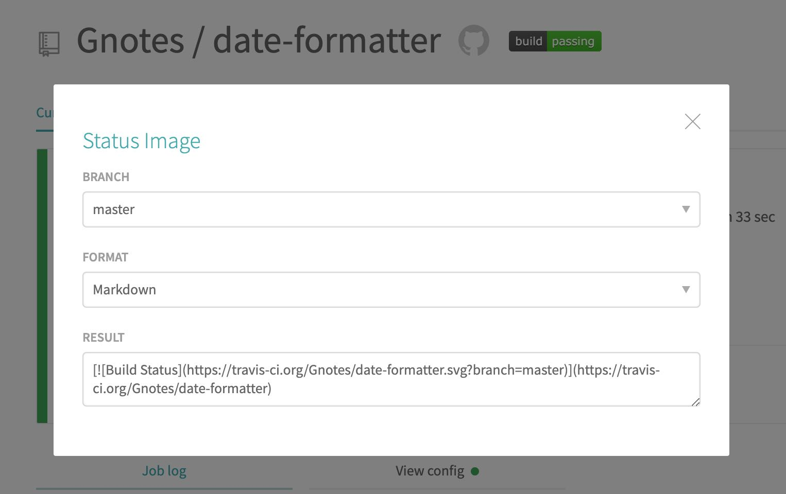
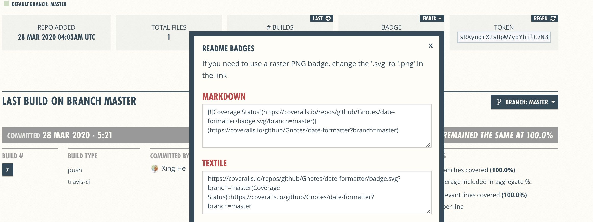

# Travis CI (持续集成)

> 持续集成 : `Continuous integration` 指的是，只要代码有 `变更`，就 **自动运行** `构建` 和 `测试`，反馈运行结果。确保 `符合预期` 以后，再将新代码 `"集成"到主干`

优点：

```
（1）快速发现错误。每完成一点更新，就集成到主干，可以快速发现错误，定位错误也比较容易。
（2）防止分支大幅偏离主干。如果不是经常集成，主干又在不断更新，会导致以后集成的难度变大，甚至难以集成。
```

### Travis CI

[Travis CI](https://travis-ci.org/) 提供的是持续集成服务，对 Github 开源仓库免费使用。

#### 准备工作

> ① GitHub `帐号`  
> ② 该帐号下面有一个 `开源项目`  
> ③ 该项目里面有 `可运行的代码`  
> ④ 该项目还包含 `构建` 或 `测试` 脚本

#### 配置 Travis 需要集成的仓库

访问 [Travis CI](https://travis-ci.org/)，使用 **Github** 账号授权登录，并设置需要配置 CI 的仓库

<div align="center">

<br/>

</div>

点击 `Switch` 开关组件 `开启` CI 服务，然后点击 **设置(Setting)** 即可进行配置

> 第一次进来是需要先授权，然后才能看到可用的仓库

配置页中包含 `General 通用`、 `Auto Cancellation 自动取消`、 `Environment Variables 环境变量`、 `Cron Jobs 定时任务`、 `Beta Features 新特性` 等 5 个部分。

需要留意的是 **环境变量** 中 `DISPLAY VALUE IN BUILD LOG` 开关，由于构建日志别人是可以拿到的，这个是用来是否 **`明文`** 显示环境变量的值，如果明文显示的话，我们的一些如秘钥的变量就会被人拿到。

<div align="center">

</div>

#### .travis.yml

Travis 要求项目的 `根目录` 下面，必须有一个 `.travis.yml` 配置文件，且该文件必须保存在 Github 仓库里面，一旦代码仓库有新的 Commit，Travis 就会去找这个文件，执行里面的命令，这个文件采用 [YAML](http://www.ruanyifeng.com/blog/2016/07/yaml.html) 格式，如下是一个 `nodejs` 配置

```yml
language: node_js
node_js:
  - 10.18.1
cache:
  directories:
    - node_modules
before_script:
  - yarn add codecov.io coveralls
after_success:
  - yarn run codecov
  - yarn run coveralls
script:
  - yarn run build
  - yarn run test
```

### 运行流程

任何项目都会经过如下两个必须的阶段

```
① install: 安装依赖
② script : 运行脚本
```

#### install

如果有多个脚本，可以写成下面的形式

```yml
install:
  - command1
  - command2
```

上面代码中，如果 `command1` 失败了，整个构建就会停下来，不再往下进行

如果不需要安装，即跳过安装阶段，就直接设为 true

```yml
install: true
```

#### script

用法与 install 一致

注意，`script` 与 `install` 的 **区别** 是：如果 `command1` 失败，`command2` 会继续执行。**但是，整个构建阶段的状态是失败**

如果 `command2` 只有在 `command1` 成功后才能执行，就要写成下面这样

```yml
script:
  - command1 && command2
```

### 完整生命周期

```
1. before_install
2. install
3. before_script
4. script
5. aftersuccess or afterfailure
6. [OPTIONAL] before_deploy
7. [OPTIONAL] deploy
8. [OPTIONAL] after_deploy
9. after_script
```

#### 加密参数

查看阮老师的 [持续集成服务 Travis CI 教程](http://www.ruanyifeng.com/blog/2017/12/travis_ci_tutorial.html)

### 测试覆盖率

> 测试覆盖率就是运行的测试覆盖了多少代码里的逻辑

在单元测试之后我们通常都会输出 `测试覆盖率报告` **coverage**，如单元测试工具 `Jest` 的 `--coverage` 就可以指定输出测试报告

```
 --coverage  Indicates that test coverage information should be collected and reported in the output.
```

输出如下报告目录

```bash
coverage
├── clover.xml
├── coverage-final.json
├── lcov-report
└── lcov.info
```

#### 上报覆盖率

[**Coveralls**](https://coveralls.io/) 和 [**codecov**](https://codecov.io/) 用于收集测试覆盖率报告，对于开源项目免费，同样使用 **Github** 账号授权登录

在上方示例配置中我们安装了 [codecov.io](https://www.npmjs.com/package/codecov.io) 和 [coveralls](https://www.npmjs.com/package/coveralls)这两个 `node` 包用于上报覆盖率，具体使用方式如下：

```yml
after_success:
  - cat ./coverage/lcov.info | codecov
  - cat ./coverage/lcov.info | coveralls
```

当然也可以配置在 `package.json` **scripts** 中，然后像我那样使用 `yarn run codecov`

### 文档徽章 Badge

徽章可以在对应网站构建成功后获取到，如：

<div align="center">


</div>

#### shields

当然也可以使用 [Shields](https://shields.io/) 提供的徽章，优点是丰富且样式统一。如： 

### 参考

- [Travis Docs](https://docs.travis-ci.com/)
- [持续集成 / 持续交付 / 持续部署](http://www.ruanyifeng.com/blog/2015/09/continuous-integration.html)
- [持续集成 / 持续交付 / 持续部署](https://blog.csdn.net/qq_35368183/article/details/84558134)
- [持续集成服务 Travis CI 教程](http://www.ruanyifeng.com/blog/2017/12/travis_ci_tutorial.html)
- [测试覆盖率](https://segmentfault.com/p/1210000008663419/read)
- [Travis 部署 gh-pages 配置](https://docs.travis-ci.com/user/deployment/pages/)
